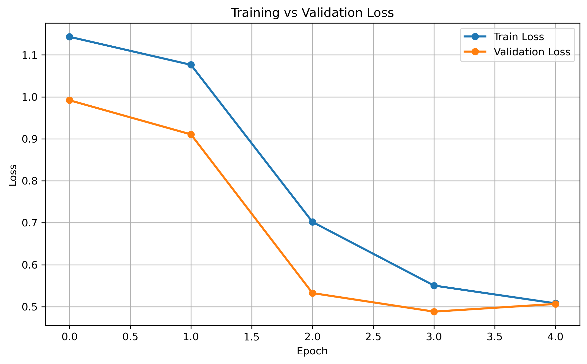
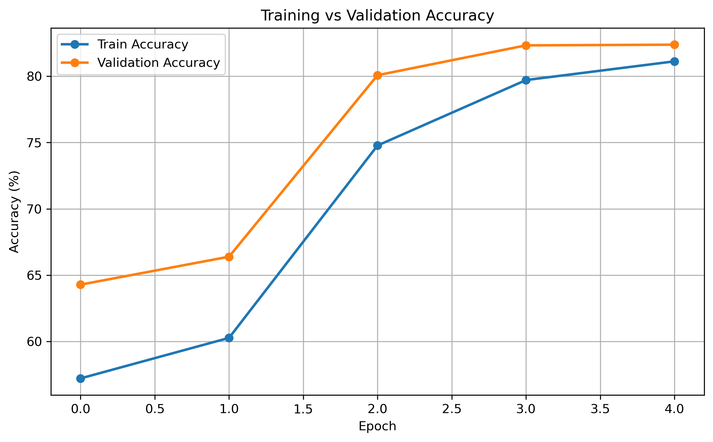
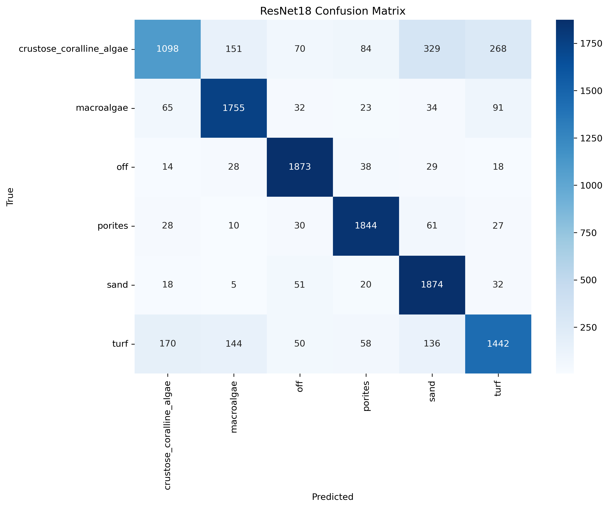
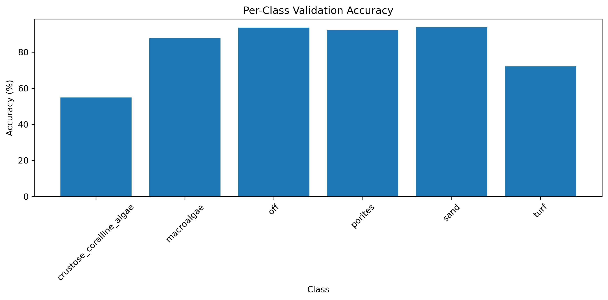

# Coral Patch Classification using Deep Learning
## Overview
This project presents a deep learning pipeline for coral reef benthic classification using annotation-guided patch extraction and transfer learning.

Instead of classifying entire underwater reef images containing multiple coral categories, the dataset was transformed into single-label image patches using expert-provided annotation coordinates. This significantly improved label quality and enabled effective supervised learning.

A ResNet18 model was trained on a balanced dataset of 60,000 coral image patches and achieved **82.38% validation accuracy** across six benthic classes.
---
## Dataset
### Original Dataset
* 418,310 coral annotations
* 2,455 annotated reef images
* Image Resolution: approximately 1116 × 906 pixels
* Multiple coral categories present within each image

### Selected Classes
The six most representative benthic classes were selected:
1. Crustose Coralline Algae (CCA)
2. Macroalgae
3. Off
4. Porites
5. Sand
6. Turf

### Balanced Patch Dataset
* Patch Size: 224 × 224
* Total Patches: 60,000
* Classes: 6
* Samples per Class: 10,000
---
## Methodology
### 1. Annotation Processing
Coral annotation coordinates were extracted from the provided CSV annotations.
### 2. Patch Extraction
For every annotation:
* Annotation-centered crop
* Patch size: 224 × 224
* Label inherited from annotation class
### 3. Dataset Balancing
An equal number of samples were selected for all six classes to prevent class imbalance.
### 4. Data Augmentation
* Horizontal Flip
* Vertical Flip
* Rotation
* Color Jitter
* ImageNet Normalization
### 5. Model Training
Model:
* ResNet18 (Transfer Learning)
Training Strategy:
* Phase 1: Train Classification Head
* Phase 2: Fine Tune Entire Network
---
## Results
### Overall Performance
| Metric              | Value          |
| ------------------- | -------------- |
| Validation Accuracy | 82.38%         |
| Macro F1 Score      | 81.79%         |
| Classes             | 6              |
| Dataset Size        | 60,000 Patches |

### Training Curves
#### Training vs Validation Loss

#### Training vs Validation Accuracy

### Per-Class Accuracy
| Class                    | Accuracy |
| ------------------------ | -------- |
| Crustose Coralline Algae | 54.90%   |
| Macroalgae               | 87.75%   |
| Off                      | 93.65%   |
| Porites                  | 92.20%   |
| Sand                     | 93.70%   |
| Turf                     | 72.10%   |
---
## Visualizations
### Sample Coral Patches


### Confusion Matrix


### Per-Class Accuracy

---
## Project Structure
```text
Coral-Patch-Classification/
│
├── notebooks/
├── results/
├── images/
├── data_info/
└── README.md
```
---

## Technologies Used
* Python
* PyTorch
* OpenCV
* NumPy
* Pandas
* Matplotlib
* Scikit-learn
* Jupyter Notebook
---
## Future Work
* EfficientNet Comparison
* Coral Segmentation Models
* Attention-Based CNN Architectures
* Calibration Artifact Removal
* Larger Multi-Class Coral Classification
